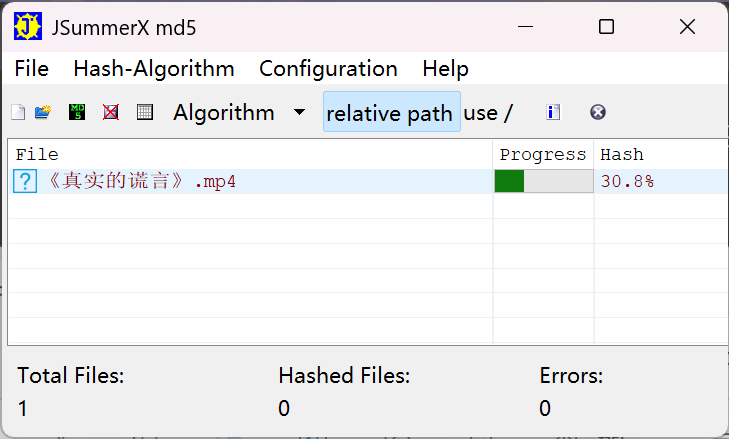
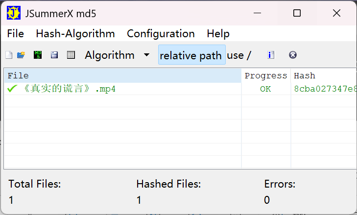
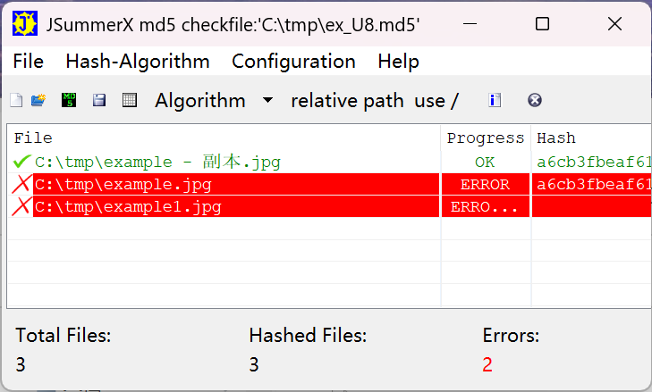

# JSummer
JSummer is a tool to compute and check CRC32, MD5, MD4, MD2, SHA-160, SHA-256, SHA-384, SHA-512, RIPEMD128, RIPEMD160, WHIRLPOOL, TIGER, HAVAL message digest consisting of a Console-Version and GUI (SWT). Implemented in Java.

Original website: https://sourceforge.net/projects/jsummer/

The md5 file is ANSI / GBK / UTF-8 codepage. JSummer do support common charset. And you can set it at Configuration Menu.

### Screenshot

